# Artificial Intelligence

Notes on what AI is and how it evolved — from the Turing test to agentic AI.

---

## Table of Contents

**Chapter 1 — [Evolution of AI](#chapter-1-evolution-of-ai)**

1. [What is Artificial Intelligence](#what-is-artificial-intelligence)
2. [The Early Years — 1950s](#the-early-years-1950s)
3. [Deep Blue — 1997](#deep-blue-1997)
4. [Rule-Based AI — 1957 to 1980](#rule-based-ai-1957-to-1980)
5. [AI after 1980 — Machine Learning](#ai-after-1980-machine-learning)
6. [Deep Learning](#deep-learning)
7. [ML vs DL](#ml-vs-dl)
8. [Computer Vision Revolution](#computer-vision-revolution)
9. [Natural Language Processing](#natural-language-processing)
10. [Transformer — The Game Changer](#transformer-the-game-changer)
11. [Large Language Models](#large-language-models)
12. [Generative AI](#generative-ai)
13. [The ChatGPT Moment](#the-chatgpt-moment)
14. [Multimodal AI](#multimodal-ai)
15. [Agentic AI](#agentic-ai)
16. [Full Timeline](#full-timeline)

**Chapter 2 — [Search Engine vs LLM](#chapter-2-search-engine-vs-llm)**

**[Quick Revision](#quick-revision)**

---

## Chapter 1 — Evolution of AI

How AI got from "can a machine think" to models that plan and act.

### What is Artificial Intelligence

**AI = a task that requires human intelligence + a machine that can do that task.**

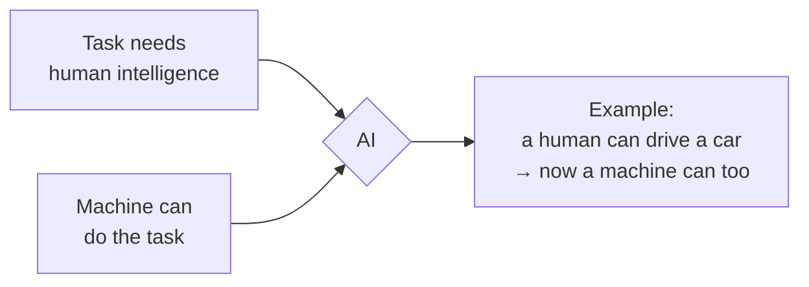

Example: driving a car needs human intelligence. When a machine can do it, that is AI.

#### Synthetic Intelligence

Another name for the same idea — **human-created intelligence**. Intelligence that did not come from nature, but was built.

#### What machine intelligence must do

1. Learn from data
2. Recognise patterns
3. Make decisions
4. Solve unplanned scenarios

Point 4 is the real test. Anything can follow a script; intelligence shows up when the situation was never scripted.

### The Early Years — 1950s

#### 1. 1950 — Alan Turing

Turing put forward the statement that **a machine can think**, and the **Turing test** was performed to check it.

The test: two rooms — one has a human, the other has a machine. A person asks both of them questions, and has to identify which answer came from the human and which came from the machine. If they cannot tell, the machine passes.

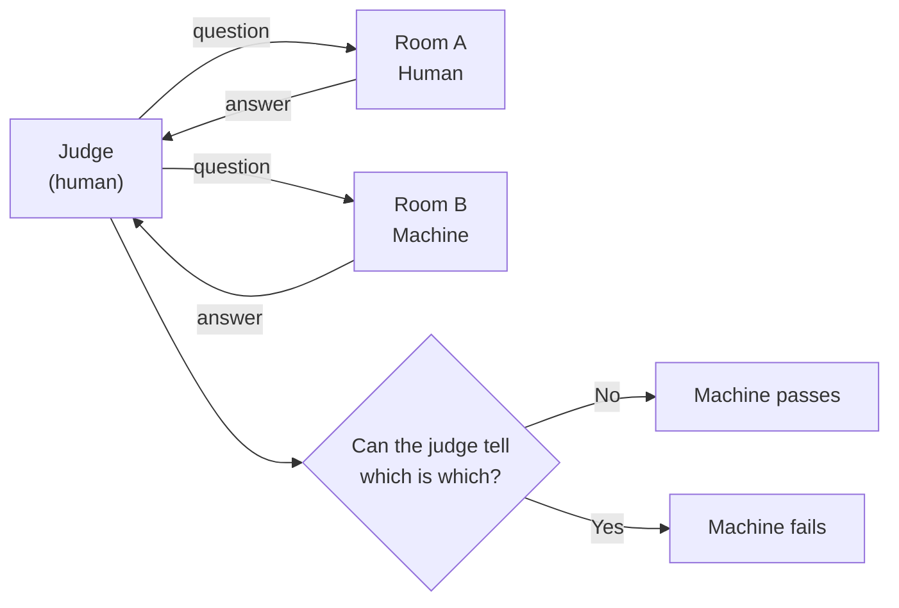

#### 2. 1955 — John McCarthy

He **introduced the word "AI"**. The field was formally born at the Dartmouth conference the following year, 1956.

#### AI Winter

After the early excitement, results did not arrive. **No major funding in AI** — this stretch is called the AI winter. There were two of them (roughly the mid-1970s and the late 1980s), and both followed the same pattern: big promises, small results, money gone.

### Deep Blue — 1997

**Deep Blue** was the first machine — a chess engine — which **defeated the human champion of chess** at that time, Garry Kasparov.

**But it was not AI.**

It was generally a huge dataset that worked on **permutations and combinations**. It searched enormous numbers of possible moves very fast and picked the best one. It did not learn anything. Play it a thousand games and it would be exactly as good on the last one as the first.

!!! note "Date check"
    The Deep Blue match against Kasparov was **1997**, not 1957. 1957 is the start of the rule-based era below.

### Rule-Based AI — 1957 to 1980

AI in this period worked on **sets of rules**.

Many rules were **prefilled**, and based on that huge set of `if-else` conditions, it used to work that way.

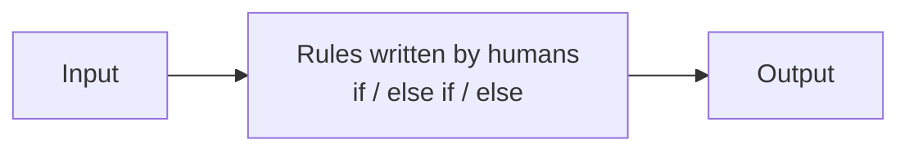

Example: an early medical system storing "IF fever AND rash THEN check measles" — every one of those lines written by hand, by a human expert.

The limit is obvious in hindsight: the real world has more cases than anyone can write rules for.

### AI after 1980 — Machine Learning

**Machine learning comes into the picture.** Instead of rules, it works on **examples**.

We used to give examples to the machine, feed it all the data, and the machine used that data to **predict** — does this look like 80% a cat?

But note what that means: **the human still has to input the data**, and the machine only predicts from that data. It never learns beyond what was fed.

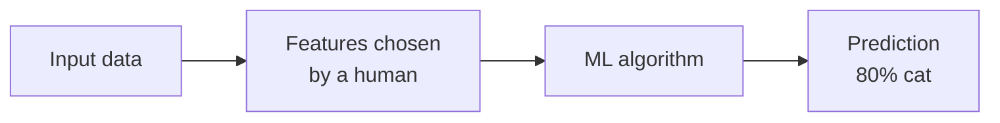

The human's job moved from *writing rules* to *choosing features* — the "this is what matters about the image" step. That step is called **feature engineering**, and it is the bottleneck deep learning removes.

### Deep Learning

#### Neural Networking

**Instead of a human telling it, the computer can learn automatically.**

The features are no longer hand-picked. The network figures out for itself which patterns matter — early layers catch edges, later layers catch shapes, later still whole objects.

Where it showed up:

- Image recognition
- Speech recognition
- Translation
- GPU revolution
- Internet and large datasets

The last two are the reason it worked *now* and not in 1990. The maths was mostly already known. What was missing was enough data and enough compute — the internet supplied one, GPUs the other.

### ML vs DL

| Machine Learning | Deep Learning |
| --- | --- |
| Requires a small dataset | Needs very large datasets |
| Faster training | Slow, compute-heavy training |
| Structured data | Handles raw data — images, audio, text |
| **Feature engineering** done by humans | A specialised subset of ML based on **artificial neural networks**, inspired by the human brain |
| `Input data → features extract → ML algo → output` | `Input data → neural network learns features itself → output` |

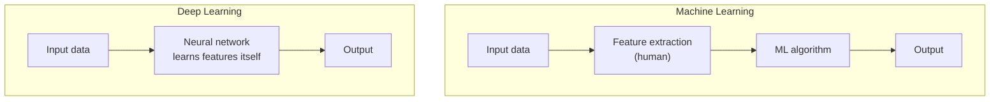

DL sits inside ML, which sits inside AI:

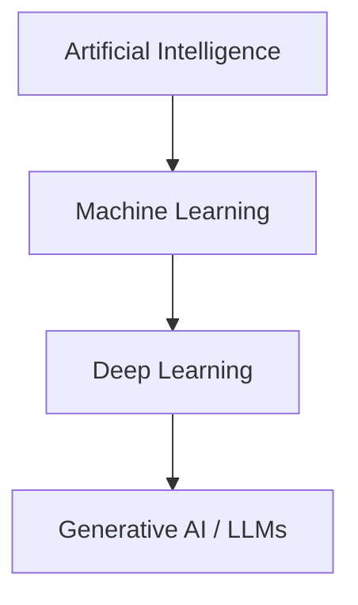

### Computer Vision Revolution

The two ingredients:

- **The image dataset — ImageNet**
- **The trained large neural network**

Here large datasets go under lots and lots of deep neural network layers and get trained.

The moment this became real was **AlexNet in 2012** — a deep network that won the ImageNet competition by such a wide margin that the field switched to deep learning almost overnight.

Where it helped:

- Face unlock
- Self-driving cars
- X-ray and medical imaging

**From here, the machine can actually see.**

### Natural Language Processing

NLP created a great impact, but here we got to know that **the most difficult thing to process is text**.

Text is hard because meaning depends on order and on distance — "the dog bit the man" and "the man bit the dog" use identical words, and the word that explains a pronoun can sit twenty words away.

The progression:

| Step | Approach | What it does | Limitation |
| --- | --- | --- | --- |
| 0 | **Bag of Words** | Counts which words appear | Throws away word order completely |
| 1 | **n-grams** | Looks at 2–3 word groups | Context still very short |
| 2 | **RNN** | Reads word by word, carries a memory | Forgets across long sentences |
| 3 | **LSTM** | RNN with a gated memory cell | Better memory, but strictly sequential and slow |

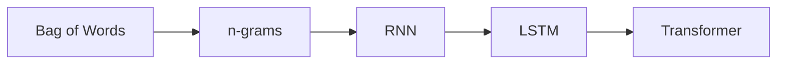

Every step here is an attempt to solve one problem: **how far back can the model remember?**

### Transformer — The Game Changer

**The transformer is an algorithm — the game changer of AI after 2017.** It connected all the dots at the time of deep learning, and a lot more concepts came after it.

The paper is *Attention Is All You Need* (2017), and the key idea is **attention**: instead of reading word by word like an RNN, the model looks at **all words at once** and works out how strongly each word relates to every other word.

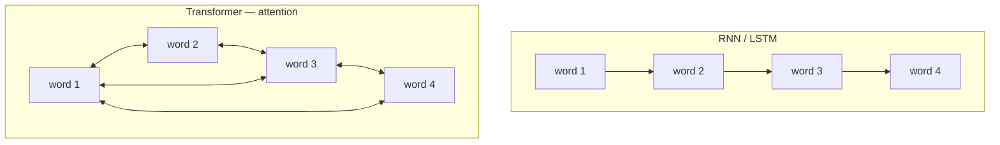

Two things follow from that:

- **Long-range context** — the model can link a word to another one far away in the text.
- **Parallel training** — no waiting for word 1 before word 2, so training can use the whole GPU at once. This is what made training on internet-scale data possible.

### Large Language Models

> **"Transformer trained on very, very large datasets."**

**GPU + Data = a good LLM model.**

An LLM is trained on one simple objective — predict the next word — repeated over a colossal amount of text. Everything else (answering, summarising, writing code) falls out of doing that well enough.

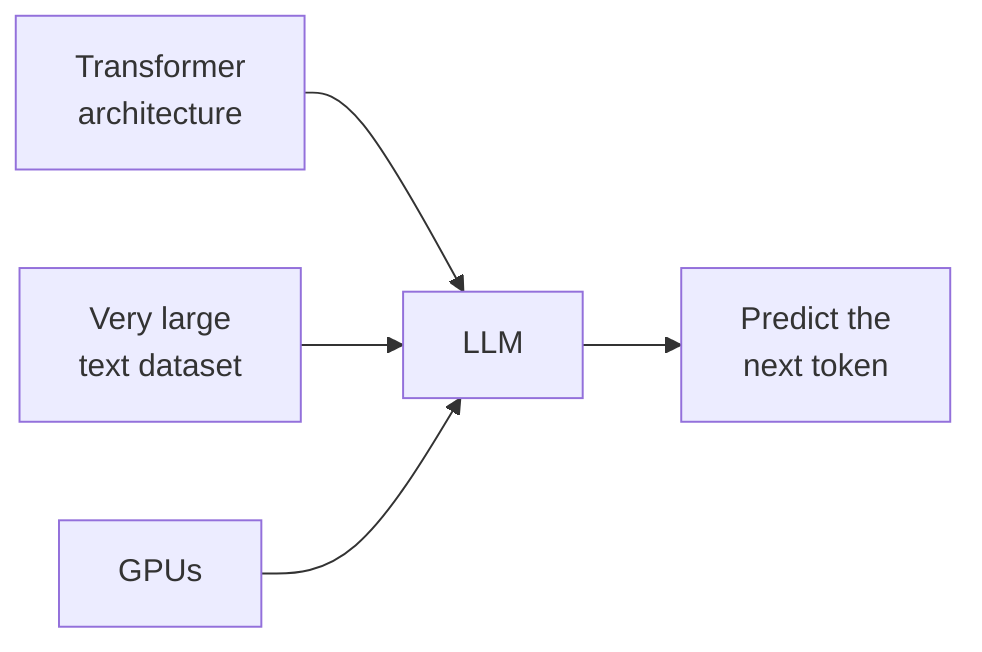

### Generative AI

**Earlier, AI could do:**

- Classification
- Predictions
- Recommendations

**Now, AI can generate anything — this is the new thing.** Here comes **Generative AI**.

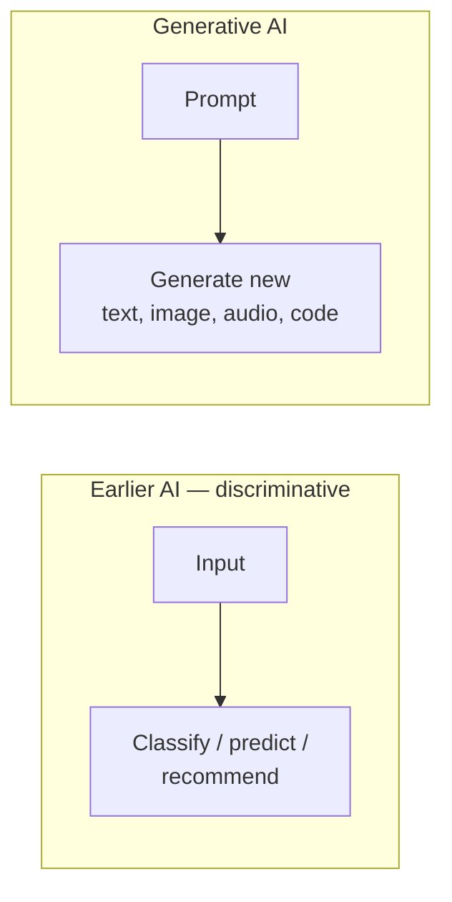

The difference in one line: earlier AI **picked from options that already existed**; generative AI **produces something that did not exist before**.

### The ChatGPT Moment

**November 2022.**

The technology was not new — the transformer was five years old and GPT models already existed. What changed was **access**: it was put behind a chat box that anyone could type into, with no setup and no code. That is what turned a research field into something everybody used.

### Multimodal AI

Not just text. The same model accepts and produces **multiple kinds of input** — text, images, audio, video, documents.

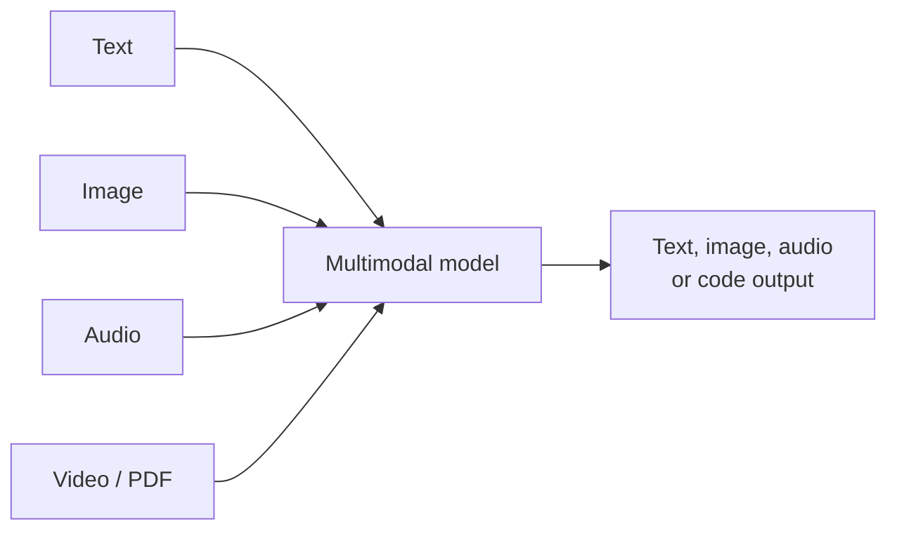

Example: show it a photo of a chart and ask "what is the trend here" — one model handles both the seeing and the answering.

### Agentic AI

The current step. Instead of answering once, the model **plans, uses tools, and acts in a loop** until a goal is reached.

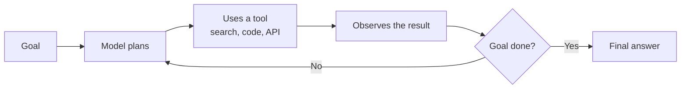

Chat answers a question. An agent **finishes a task**.

---

### Full Timeline

| Year | Milestone |
| --- | --- |
| 1950 | Alan Turing — "can a machine think", the Turing test |
| 1956 | John McCarthy — coins the word **AI** (proposed 1955, Dartmouth 1956) |
| 1957 – 1980 | **Rule-based AI** — prefilled `if-else` rules |
| 1970s – 80s | **AI winters** — no major funding |
| 1980s onward | **Machine Learning** — learn from examples |
| 1997 | **Deep Blue** defeats Garry Kasparov (brute force, not AI) |
| 1990s – 2000s | **Deep learning** research, neural networks |
| 2012 | **AlexNet** — ImageNet, the computer vision revolution |
| 2016 | **AlphaGo** beats Lee Sedol |
| 2017 | **Transformers** — *Attention Is All You Need* |
| 2018 – 2020 | **GPT** models scale up |
| Nov 2022 | **The ChatGPT moment** |
| 2023 – 2024 | **Multimodal AI** |
| 2025 | **Agentic AI** |

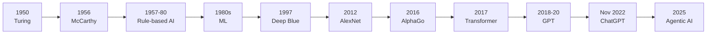

---

## Chapter 2 — Search Engine vs LLM

**Search engine** → matches relevant documents and **returns results**.

**ChatGPT** → takes a prompt, uses learned patterns, **predicts** and **generates text**.

```text
Search Engine  →  Retrieve
LLM            →  Generate
```

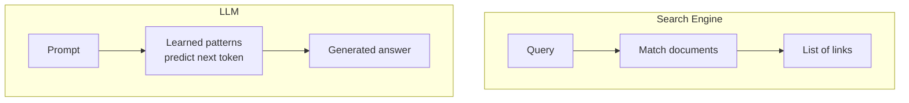

| | Search Engine | LLM |
| --- | --- | --- |
| Job | Retrieve | Generate |
| Output | Links to existing pages | New text written on the spot |
| Source | Documents that exist | Patterns learned in training |
| Wrong answers | Gives an irrelevant link | Can state something false confidently |

The two combine well — retrieve first, then generate from what was retrieved. That combination is called **RAG** (Retrieval-Augmented Generation): search your own documents, then hand the best passages to the LLM so its answer is grounded in real sources instead of memory alone.

---

## Quick Revision

- **AI** — task needing human intelligence, done by a machine.
- **1950 Turing test** → **1955/56 McCarthy names AI** → **AI winter**.
- **Deep Blue (1997)** — brute force permutations, not AI, learned nothing.
- **1957–1980 rule-based** — humans write every `if-else`.
- **After 1980, ML** — learn from examples, but humans still pick the features.
- **Deep learning** — the network learns the features itself; needed GPUs + internet-scale data.
- **AlexNet 2012** — the machine can actually see.
- **NLP** — text is the hardest: Bag of Words → n-grams → RNN → LSTM.
- **Transformer 2017** — attention, long-range context, parallel training. The game changer.
- **LLM** — transformer + very large datasets + GPUs.
- **Generative AI** — earlier AI classified, now AI creates.
- **Nov 2022** — the ChatGPT moment put it in everyone's hands.
- **Multimodal → Agentic AI** — many input types, then models that plan and act.
- **Search engine retrieves; an LLM generates.**
