# Node.js

Notes on how Node.js actually works — from the V8 engine underneath it, through modules and the event loop, up to building APIs and talking to a database.

---

## Table of Contents

**Chapter 1 — [Node.js Fundamentals](#chapter-1-nodejs-fundamentals)**

1. [What is Node.js](#what-is-nodejs)
2. [JS Engine and V8](#js-engine-and-v8)
3. [ECMAScript](#ecmascript)
4. [Node.js Architecture](#nodejs-architecture)
5. [Code Hierarchy](#code-hierarchy)
6. [global, this, globalThis](#global-this-globalthis)
7. [Web Workers vs Worker Threads](#web-workers-vs-worker-threads)

**Chapter 2 — [Modules](#chapter-2-modules)**

8. [Import and Export](#import-and-export)
9. [CommonJS vs ES Modules](#commonjs-vs-es-modules)
10. [How Modules Are Wrapped — IIFE](#how-modules-are-wrapped-iife)
11. [require — Step by Step](#require-step-by-step)

**Chapter 3 — [How Node Runs Code](#chapter-3-how-node-runs-code)**

12. [JS is Sync, Node Makes it Async](#js-is-sync-node-makes-it-async)
13. [Inside V8 — Heap, Call Stack, GC](#inside-v8-heap-call-stack-gc)
14. [libuv](#libuv)
15. [Garbage Collector](#garbage-collector)
16. [fs Module](#fs-module)
17. [How Code is Executed](#how-code-is-executed)
18. [Interpreter vs Compiler vs JIT](#interpreter-vs-compiler-vs-jit)

**Chapter 4 — [Event Loop](#chapter-4-event-loop)**

19. [Event Loop in Node.js](#event-loop-in-nodejs)
20. [Process of the Event Loop](#process-of-the-event-loop)
21. [Priority Queue vs Phase](#priority-queue-vs-phase)
22. [Thread Pool](#thread-pool)

**Chapter 5 — [Server and Networking](#chapter-5-server-and-networking)**

23. [Server](#server)

**Chapter 6 — [Databases](#chapter-6-databases)**

24. [Databases](#databases)
25. [RDBMS vs NoSQL](#rdbms-vs-nosql)

**Chapter 7 — [Building APIs](#chapter-7-building-apis)**

26. [Planning Before Building](#planning-before-building)
27. [Monolith vs Microservices](#monolith-vs-microservices)
28. [Taking Input Through APIs](#taking-input-through-apis)
29. [Middleware and Routes](#middleware-and-routes)

**Chapter 8 — [Mongoose and MongoDB](#chapter-8-mongoose-and-mongodb)**

30. [Mongoose Basics](#mongoose-basics)
31. [Schema and CRUD](#schema-and-crud)
32. [Validation](#validation)
33. [Useful Libraries](#useful-libraries)
34. [select, populate, skip and limit](#select-populate-skip-and-limit)
35. [Query Operators](#query-operators)

**[Quick Revision](#quick-revision)**

---

## Chapter 1 — Node.js Fundamentals

### What is Node.js

A client talks to a server over the network using an IP address. The server runs JavaScript — that is Node.js.

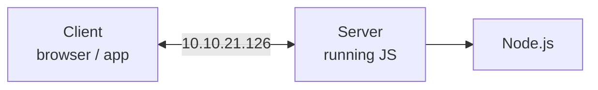

Node.js is a runtime environment that allows JavaScript to run **outside the browser**. It is built on the **V8 engine**, Google's open-source JavaScript engine used in Chrome.

### JS Engine and V8

- The JS engine is the **V8 engine**.
- It is written mostly in **C++**.
- **V8 can be embedded into any C++ program.**
- **Node.js is an application of C++** — it embeds V8 and adds its own powers on top.

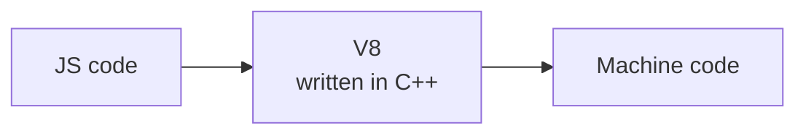

**Real-life example:** V8 is a translator who converts English (JavaScript) into a language the computer (processor) understands (machine code). The faster the translator, the quicker the response.

That one fact — *V8 can be embedded in any C++ program* — is the whole reason Node.js exists. Someone took the browser's JS engine, wrapped it in a C++ program, and gave it file access and networking.

### ECMAScript

**ECMAScript = the rules or script which a programming language (JS) should follow.**

- Rules to write code — for example `===`
- The rules come from JS, and are used by ECMAScript

**Why it matters:**

- It keeps JavaScript consistent across different environments.
- New features like `let`, `const`, arrow functions, and `async/await` arrive in newer versions (ES6, ES7, …).

**Real-life example:** ECMAScript is a rulebook for a game. Different versions introduce new rules to improve gameplay, just like ES6 and ES7 introduced better features for JavaScript.

### Node.js Architecture

Node.js = **V8 engine (C++) + super power (C++)**. That combination is what serves your API.

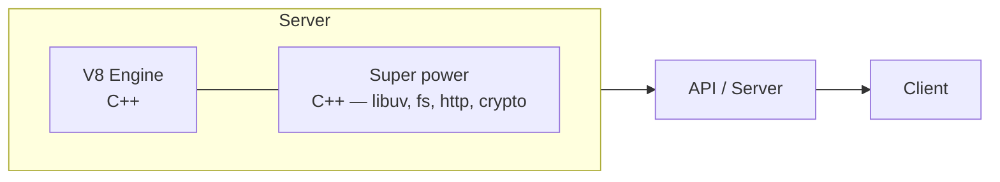

Node.js follows an **event-driven, non-blocking I/O** model, which makes it scalable for many simultaneous requests:

- A request is received by Node.js.
- The event loop processes the request asynchronously.
- If the request needs I/O (a database query, a file read), Node.js hands it off.
- Once complete, the response is sent back.

**Real-life example:** A restaurant where the waiter takes many orders without waiting for one to finish. The chef prepares the food (I/O), and the waiter serves it when ready.

### Code Hierarchy

| Level | Who reads it | Looks like |
| --- | --- | --- |
| **High level code** | Human | `const a = 10` |
| **Assembly code** | Between the two | `001F02C2184` |
| **Machine code** | — | bits and bytes |
| **Binary code** | Computer | `0` and `1` |

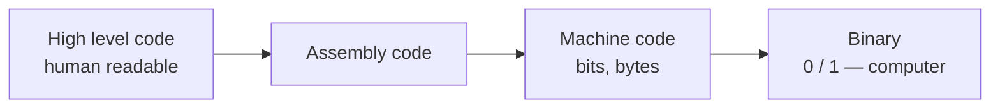

**Real-life example:** A human reads a recipe as a whole, understanding ingredients and steps. A computer, like a robotic chef, follows each step precisely, one at a time.

### global, this, globalThis

**1. `global`** — it is a part of Node (extra power). Like in the browser we have `window`.

- It is **similar to `window`** in Node.js, and it contains `console.log`, `setTimeout`, `setInterval`.
- If any variable is declared **without** `let`, `var`, `const`, it is considered a **global variable**.
- It is available throughout the Node.js environment.

Other globals worth knowing:

```javascript
console.log(__dirname);  // directory of the current script
console.log(__filename); // full path of the current file
console.log(process.argv); // info about the Node.js process
```

**2. `this`** — it is an empty object at module level, and it behaves differently in different circumstances:

| Where | What `this` is |
| --- | --- |
| Module top level — `console.log(this)` | `{}` — empty object |
| Inside a function | global object |
| Inside an object method — `obj.show()` | the object → `Kaushal` |
| Inside a class | same as object method |
| Inside an arrow function | `undefined` |

**3. `globalThis`** — the common global variable. It is **free from any environment** and can be used anywhere in the application.

| Environment | Global keyword |
| --- | --- |
| Browser | `window` |
| Node.js | `global` |
| Web worker | `self` |
| **`globalThis`** | **all environments** |

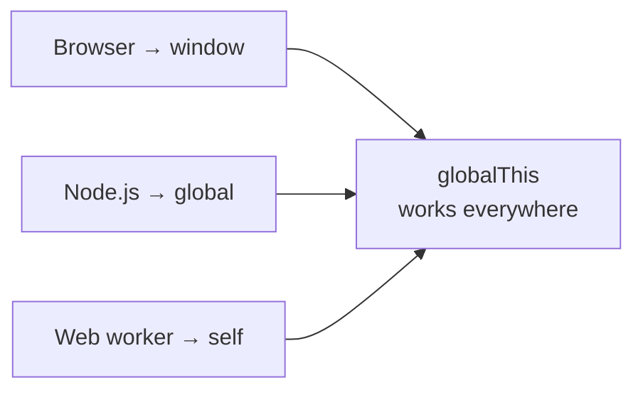

**Real-life example:** `global` is a school notice board where common information (like holidays) is visible to all students (scripts).

### Web Workers vs Worker Threads

| | Web Workers | Worker Threads |
| --- | --- | --- |
| Where | **Browser** | **Node.js** |
| Purpose | Separate the UI thread logic into a different thread, for better CPU optimisation | Separate the JS logic into another thread |
| Used for | Keeping the UI responsive | Heavy operations like cryptography or image processing |

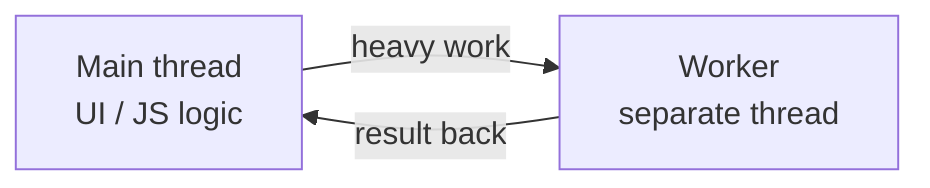

### Modules Protect Your Code

**Modules protect the variables and functions from leaking.** Anything you declare in a file stays inside that file until you explicitly export it.

Types of modules:

- **Built-in modules** — shipped with Node.js (`fs`, `http`, `path`)
- **Custom modules** — your own files
- **Third-party modules** — installed via npm (Express, Lodash)

**Real-life example:** Modules are like subjects in school. Instead of one giant book, the content is split into separate books (files) for better understanding.

---

## Chapter 2 — Modules

### Import and Export

```javascript
// sum.js
const sum = (a, b) => a + b;
module.exports = { sum };

// app.js
const { sum } = require("./sum.js");
```

**All our variables and methods are protected inside the module — we just need to export what we want to share.**

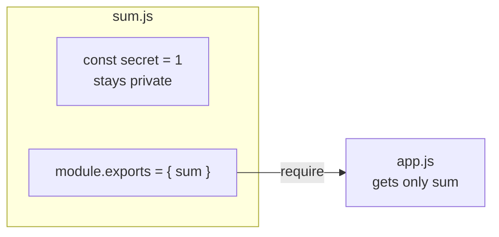

### CommonJS vs ES Modules

| | **CommonJS (CJS)** | **ES Modules (ESM)** |
| --- | --- | --- |
| Export | `module.exports` | `export` |
| Import | `require()` | `import` |
| Default in | **Node.js** | **Angular, React** |
| Age | Older way | Newer way |
| `package.json` | `"type": "commonjs"` | `"type": "module"` |
| Calls | **Sync** call | **Async** option available |
| Mode | Non-strict mode | **Strict mode** |

Both do the same job; ESM is the direction the language is heading, CJS is what most existing Node code is written in.

**Two more points:**

- `module.exports` starts life as an **empty object** — you are filling it in.
- **Import a JSON file the same as a JS file.** Node parses it and hands you the object.

```javascript
const data = require("./config.json"); // straight to an object
```

### How Modules Are Wrapped — IIFE

- **All the code of a module is wrapped inside a function.**
- **IIFE = Immediately Invoked Function Expression.**
- That wrapping is what keeps your variables private.

**In Node.js, modules are wrapped inside a function, and when you call `require` it calls that function and stores the function's code as a cache.**

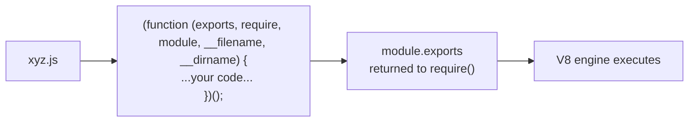

This is why `module`, `require`, `__dirname` and `__filename` are available in every file without importing them — they are the wrapper function's parameters.

### require — Step by Step

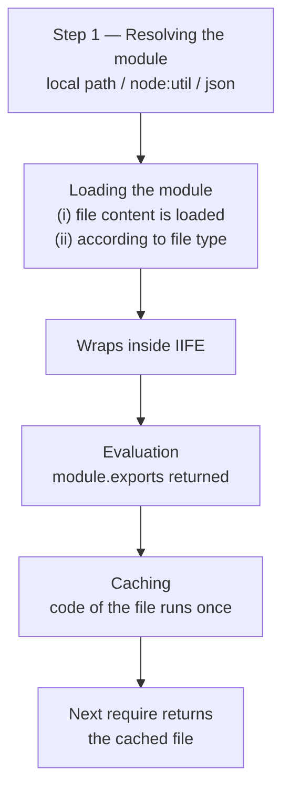

1. **Resolving the module** — is it a local path, a core module like `node:util`, or a JSON file?
2. **Loading the module** — the file content is loaded, according to its file type.
3. **Wraps inside the IIFE.**
4. **Evaluation** — `module.exports` is returned.
5. **Caching** — the code of the file runs **once**; every later `require` gets the cached copy.

The caching step has a practical consequence: a module's top-level code runs exactly once per process, no matter how many files require it. Handy for a database connection, surprising if you expected fresh state.

---

## Chapter 3 — How Node Runs Code

### JS is Sync, Node Makes it Async

**JS is sync + Node (extra features) = it becomes async.**

JavaScript by itself runs one line at a time on a single thread. Node adds the extra machinery — libuv, the thread pool, the event loop — that lets slow work happen elsewhere while the main thread keeps going.

### Inside V8 — Heap, Call Stack, GC

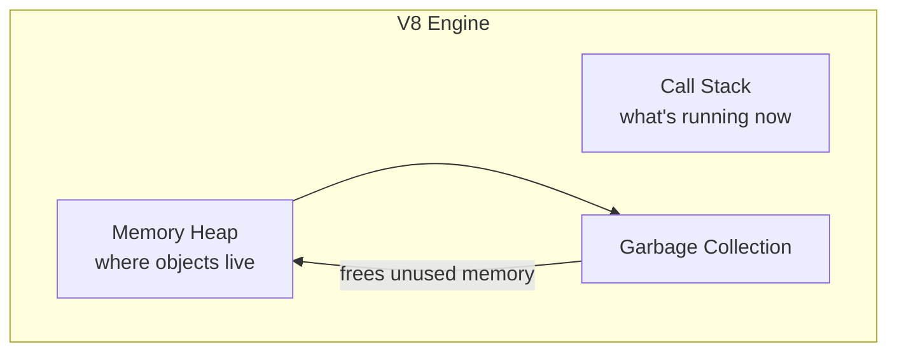

```javascript
var a = 1000;
var multiply = () => a * a;
var product = multiply(a);
```

- **Call stack** — the function currently executing sits on top.
- **Memory heap** — variables and objects are stored here.
- **GC** — cleans the heap once values are no longer reachable.

### libuv

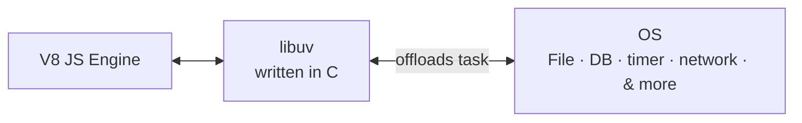

- **libuv is written in C.** It is the **middle layer that acts as a medium between the V8 engine and the OS.**
- **Node.js is async because of libuv.**
- libuv handles: files, `setTimeout`, API calls, `fs`.

V8 alone can only run JavaScript — it has no idea what a file or a socket is. Everything Node can do that a browser cannot comes through libuv.

### Garbage Collector

**It stores the unused variables, or any data which is of no use.** Once the code has executed, the garbage collector is free to release it.

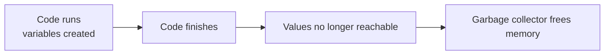

### fs Module

**`fs` is a Node.js core module which is used to read/write on the file.** It has various operations:

| Method | Behaviour |
| --- | --- |
| `fs.readFileSync` | It reads the file in **sync** fashion |
| `fs.readFile` | It reads the file **normally (async way)** |

…and so on.

```javascript
// blocks everything until the file is read
const data = fs.readFileSync("./file.txt", "utf-8");

// hands off to libuv, keeps going
fs.readFile("./file.txt", "utf-8", (err, data) => {
  console.log(data);
});
```

**We should never use sync code** — reason being, **it blocks our main thread**.

**A sync function doesn't have a callback.** That is the quickest way to spot one.

!!! warning "The rule that ties it together"
    **If the global execution context is not free, nothing from libuv will be executed.**

    Your synchronous code has to finish completely before a single callback is allowed to run. One blocking `readFileSync` freezes every other request the server is handling.

### How Code is Executed

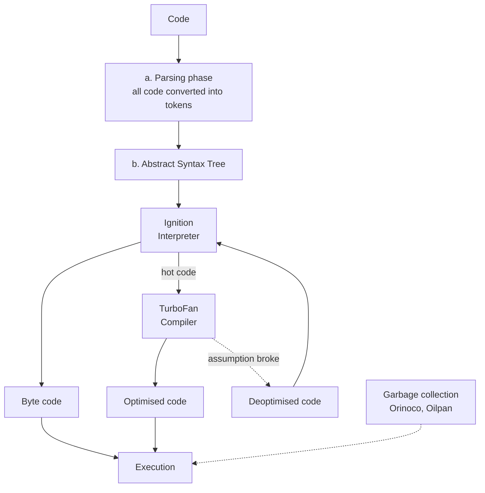

**a. Parsing phase** — all code is converted into **tokens**.

**b. Abstract Syntax Tree** — the tokens become a tree, which then goes through:

- **Ignition interpreter** → **byte code** → **execution**
- **TurboFan compiler** → **optimised code** → **execution**
- If an optimisation assumption turns out wrong, the code is **deoptimised** and sent back to the interpreter.

This is the **V8 engine architecture**. TurboFan only optimises code that runs often ("hot" code) — optimising something that runs once would cost more than it saves.

### Interpreter vs Compiler vs JIT

| | **Interpreter** | **Compiler** | **JIT** |
| --- | --- | --- | --- |
| How | Line by line code execution | Compiled into machine code | **It has both** |
| Speed | Fast initial | Initial heavy, but executes fast | Just-in-time compiler |

V8 is a JIT: Ignition gets things running immediately, TurboFan compiles the hot paths in the background.

**Syntax error** → the V8 engine is not able to generate the AST. That is why a syntax error stops the file before a single line runs, while a runtime error only appears when execution reaches it.

---

## Chapter 4 — Event Loop

### Event Loop in Node.js

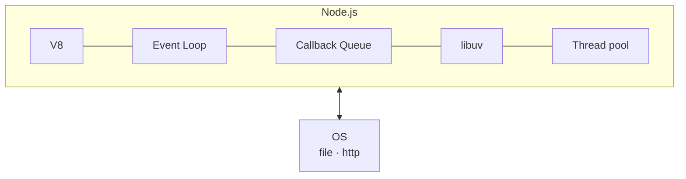

The loop runs through fixed **phases**, and between them it drains the **priority queue**:

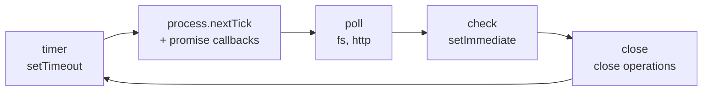

**Callback I/O covers:**

1. Incoming connections
2. Data
3. `fs`, crypto, http

### Process of the Event Loop

1. First the code is loaded to the **callback queue**.
2. **If GEC (global execution context) is empty, then only** the code from the callback queue is loaded to the event loop for execution.
3. All the **async code** is loaded for execution.
4. If there are multiple operations, then their respective callbacks will have **separate queues** inside the callback queue.
5. If GEC is empty, then the first code will go to the event loop.
    - **First the priority cycle** will be executed, before every phase.
    - **Then after that the phase** will be executed.

    | Priority cycle | Phase |
    | --- | --- |
    | 1. `process.nextTick` | 1. timer |
    | 2. priority / promise | 2. poll |
    | (based on priority) | 3. change |
    | | 4. close |

6. **It will always execute in order.** If poll is executed and we have timer and change waiting, it will execute the **change** first.
    - **It follows cycle order over priority.**
7. **If the event loop is idle it will wait on poll**, and wait for any poll operation to execute.
    - Since `fs` is a heavy operation, it is always executed at last, because it will take time to read the file.
8. If there are two phase / priority cycles, the **order of execution** depends on the order they were queued:

    | Case A | Case B |
    | --- | --- |
    | Promise ① | Promise ② |
    | `process.nextTick` ② | `process.nextTick` ① |

9. **All the priority queue will be executed first, and then all phases will be executed.**
10. If inside the priority queue any of the phases are there, then **phases will be on hold**, and when the time of that phase comes it will be executed then.

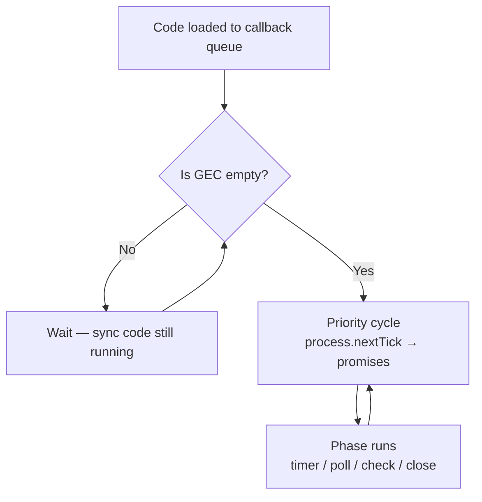

### Priority Queue vs Phase

| | Name |
| --- | --- |
| **Priority queue** | **Microtask** |
| **Phase** | **Macrotask** |

- **One cycle of the event loop is called a Tick.**

### Thread Pool

- **By default the event loop has 4 threads.**
- **It can have multiple threads, but by default it has 4** — and we can exceed that limit.

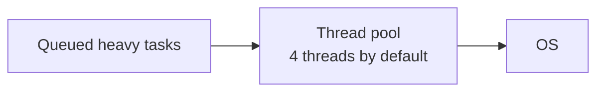

**Node.js — if we give sync code, it will behave sync. If we give async code, it will behave in an async way.**

Command to increase the thread pool:

```javascript
process.env.UV_THREADPOOL_SIZE = 8;
```

---

## Chapter 5 — Server and Networking

### Server

**There are two types of server:**

1. **Hardware** — AWS
2. **Software** — Node.js

**1. Every client has a unique IP address.**

**2. Socket connection** — the user and server hold a connection open. One socket connection is complete (on/off).

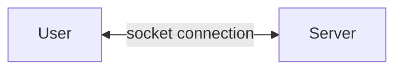

**3. Protocols**

| Protocol | Used for |
| --- | --- |
| **HTTP** | API / request |
| **FTP** | File transfer |
| **SMTP** | Mail transfer |

**4. Web server → HTTP.** Data comes in **chunks** — socket, then packets.

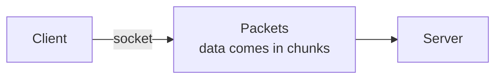

**5. DNS → Domain Name + IP.** It maps the name you type to the address the network needs.

**6. Videos come in buffering** — the same chunking idea, which is why a video can start before it has fully downloaded.

**7. Web socket connection** — **two-way communication** between client and server.

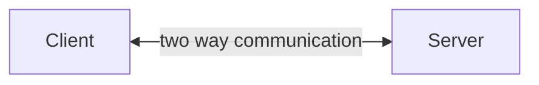

HTTP is request–response: the client has to ask. A web socket stays open so the server can push too — which is what chat and live notifications need.

---

## Chapter 6 — Databases

### Databases

**A database is an organised collection of data.** Data is stored based on the use of a **Database Management System (DBMS)**, which interacts with users.

**Types of Database:**

| Type | Example |
| --- | --- |
| **NoSQL** | MongoDB |
| **Relational DB** | MySQL, Postgres |
| **In-memory DB** | Redis |
| **Cloud** | Amazon RDS |

**RDBMS = Relational Database Management System.**

```mermaid
flowchart LR
    U["User"] <--> R["RDBMS"] <--> D[("Database")]
```

**Types of NoSQL DB:**

1. **Document DB** → MongoDB
2. **Key-Value DB**
3. **Graph DB**
4. **Wide-column DB**
5. **Multimodel DB**

### RDBMS vs NoSQL

| **RDBMS** | **NoSQL** |
| --- | --- |
| Table, Rows, Column | Document, Collection |
| Structured data | Unstructured data |
| Fixed schema | Flexible schema |
| SQL | NoSQL |
| Tough scaling | Easy to scale |
| Relationship (foreign keys, joins) | Nested |
| Read-heavy apps, transactions | Realtime data, Big data |
| **eg → Banking App** | **eg → Social Media** |

```mermaid
flowchart TB
    subgraph SQL["RDBMS"]
        direction LR
        T["Table"] --> R["Rows"] --> C["Columns"]
    end
    subgraph NO["NoSQL"]
        direction LR
        D["Collection"] --> DOC["Documents"] --> F["Fields — nested"]
    end
```

---

## Chapter 7 — Building APIs

### Planning Before Building

```mermaid
flowchart LR
    A["Requirements"] --> B["Design"] --> C["Development"] --> D["Testing"] --> E["Deployment"] --> F["Maintenance"]
```

This is the **Waterfall model** — each stage finishes before the next begins.

### Monolith vs Microservices

| **Monolith** | **Microservices** |
| --- | --- |
| Single repo | Multi repo |
| Large codebase | Small-small codebases |
| Difficult to manage | Easy to manage |
| Work is hard | Working is easy |

```mermaid
flowchart TB
    subgraph M["Monolith"]
        MO["One codebase<br/>auth + payment + orders"] --> MDB[("One DB")]
    end
    subgraph MS["Microservices"]
        direction LR
        S1["Auth"] --> D1[("DB")]
        S2["Payment"] --> D2[("DB")]
        S3["Orders"] --> D3[("DB")]
    end
```

### Taking Input Through APIs

**1. Path Parameters**

```javascript
app.get("/items/:id", (req, res) => {
  const id = req.params.id;
});
```

Use it when we have to deal with an **id**.

**2. Query Parameters**

```javascript
app.get("/items", (req, res) => {
  const page = req.query.page;
});
```

Use case: **searching, filtering, ordering data.**

**3. Headers**

```javascript
app.get("/items", (req, res) => {
  const token = req.headers["authorization"];
});
```

Use case: **authentication, set content headers.**

**4. Request Body**

```javascript
app.post("/items", (req, res) => {
  const price = req.body.price;
});
```

Use case: **creating or updating resources.**

**5. Cookies**

```javascript
app.get("/items", (req, res) => {
  const session = req.cookies.sessionId;
});
```

Use case: **maintain user session.**

| Source | Read with | Use case |
| --- | --- | --- |
| Path parameter | `req.params.id` | Dealing with an id |
| Query parameter | `req.query.page` | Searching, filtering, ordering |
| Header | `req.headers['authorization']` | Authentication, content headers |
| Body | `req.body.price` | Creating or updating resources |
| Cookie | `req.cookies.sessionId` | Maintaining a user session |

### Middleware and Routes

**Middleware are the routing methods which protect our routes**, and also maintain the user route according to their token. **It acts as a middle person who prevents the use of routes under certain conditions.**

```mermaid
flowchart LR
    R["Request"] --> M1["Middleware 1<br/>auth check"] --> M2["Middleware 2<br/>validation"] --> H["Route handler"] --> RES["res.send()"]
    M1 -.->|"fails"| E["Error handler"]
```

**The four parameters:**

```javascript
app.use((err, req, res, next) => { });
```

| Parameter | What it is for |
| --- | --- |
| `err` | To get the error, if there is one in any code |
| `req` | To get the data from the frontend |
| `res` | To send the data back in various forms |
| `next` | To move to the next callback |

**It can have `n` number of callbacks:**

```javascript
app.use("/", (req, res, next) => {}, (req, res, next) => {}, (req, res) => {});
```

**Each request can have only one `res.send`.** Sending twice throws — the response is already on its way.

**For global error handling:**

```javascript
app.use("/", (err, req, res, next) => {
  res.json({ err: "err" });
});
```

---

## Chapter 8 — Mongoose and MongoDB

### Mongoose Basics

1. **Connect to a DB.**
2. In MongoDB the hierarchy is:

```mermaid
flowchart LR
    C["Cluster"] --> D["Databases"] --> CO["Collections"] --> DOC["Documents"] --> F["Fields"]
```

### Schema and CRUD

1. **Define a schema**
2. **Create a model**
3. Refer to the documentation

```javascript
const userSchema = new mongoose.Schema({
  firstName: { type: String, required: true },
  emailId: { type: String, unique: true },
});

const User = mongoose.model("User", userSchema);
```

**CRUD in Mongoose:**

| Method | What it does |
| --- | --- |
| `find` | To get all the data of a model |
| `findOneAndDelete` | To find one and delete |
| `findOneAndUpdate` | To find one and update |
| `save` | To create an instance of a model and insert a document |

**PATCH vs PUT:**

| | Used for |
| --- | --- |
| **PATCH** | To update **some part** of the data |
| **PUT** | To update the **complete** data |

**Options field in Mongoose** — it is the **last parameter**, used to add extra power to the built-in function.

```javascript
await User.findOneAndUpdate({ _id: id }, data, {
  returnDocument: "after",
  runValidators: true, // options field
});
```

### Validation

**(a) Schema level**

| String | Number |
| --- | --- |
| `required: true` | `min: 5` |
| `unique: true` | `max: 6` |
| `minLength: 7` | |
| `trim: true` | |
| `lowercase: true` | |
| `uppercase: true` | |

**(b) `validate()`** — a custom function for anything the built-in rules can't express.

**To validate at the time of update — use the option key value:**

```javascript
{ runValidators: true }
```

Schema validation does **not** run on updates by default. That flag is what turns it on.

**Validation of API:**

- Check all the fields, and also **never trust the user**.
- Put the validation on **every field**.
- Always use a **try/catch block**.

```mermaid
flowchart LR
    R["Request"] --> A["API level validation<br/>check every field"] --> B["Schema level validation<br/>required, minLength, min/max"] --> C["custom validate()"] --> D[("Save to DB")]
```

### Useful Libraries

**(a) Validator** — to validate:

- password
- email
- mobile number
- URL
- etc.

A very useful library to validate the user data.

**(b) bcrypt** — hash the password.

- **Once a password is hashed it can never be converted back to a string.**
- We can only **compare** the password by using a built-in method.

```javascript
const hash = await bcrypt.hash(password, 10);
const isValid = await bcrypt.compare(inputPassword, hash);
```

!!! warning "Never trust user data"
    Always put checks. At the time of updating or adding to the DB, be very careful — put all the necessary checks and validation. **Data sanitisation is very crucial.**

### select, populate, skip and limit

**`select`** — it is used to include or exclude fields from the queried document.

| | Meaning | Syntax |
| --- | --- | --- |
| **include** | Only these fields come back in the search query | `.select("A B")` or `.select(['A','B'])` |
| **exclude** | The selected fields are excluded from the query | `.select("-c -d")` |

**`populate`** — it is used to give the result and **add the details of another model** in the required field.

```javascript
// in some other model
fromUserId: {
  type: mongoose.Schema.Types.ObjectId,
  required: true,
  ref: "User",          //  important
}

// then
.populate("fromUserId", "firstName lastName");
```

From the collection having `fromUserId`, it will get the userId from there and return the id of the user **and all its data from the User model**.

```mermaid
flowchart LR
    A["Request document<br/>fromUserId: 64ab…"] -->|"ref: User"| B["User collection"]
    B -->|populate| C["fromUserId: { firstName, lastName }"]
```

The `ref` is what makes it work — without it Mongoose has no idea which collection that id belongs to.

**`skip` / `limit`**

```javascript
query.skip(100).limit(10);
```

| | Meaning |
| --- | --- |
| `skip` | How many documents to skip |
| `limit` | The number of documents to show |

This pair is how pagination is built — page 11 of 10-per-page is `skip(100).limit(10)`.

### Query Operators

**1. Comparison Query**

| Operator | Meaning |
| --- | --- |
| `$eq` | equal to |
| `$gt` | greater than |
| `$gte` | greater than or equal to |
| `$lt` | less than |
| `$lte` | less than or equal to |
| `$in` | in array |
| `$nin` | not in array |
| `$ne` | not equal to |

**2. Logical Query**

| Operator | Meaning |
| --- | --- |
| `$or` | or |
| `$and` | and |
| `$not` | not |
| `$nor` | not or |

```javascript
User.find({ age: { $gte: 18, $lt: 60 } });
User.find({ $or: [{ city: "Delhi" }, { city: "Mumbai" }] });
```

---

## Quick Revision

- **Node.js = V8 (C++) + super power (C++).** V8 can be embedded in any C++ program — that is why Node exists.
- **ECMAScript** = the rulebook JS follows.
- **global** is Node's `window`; **`this`** changes by context; **`globalThis`** works in every environment.
- **Web workers** are for the browser, **worker threads** are for Node — both for heavy work off the main thread.
- **Modules protect variables from leaking** — export what you want shared.
- **CJS** = `require` / `module.exports`, sync, non-strict, Node's default. **ESM** = `import` / `export`, strict, used by React and Angular.
- Every module is **wrapped in an IIFE**, and `require` **caches** it — the file runs once.
- **require steps:** resolve → load → wrap in IIFE → evaluate → cache.
- **JS is sync; libuv makes Node async.** libuv is written in C and sits between V8 and the OS.
- **Never use sync code** — it blocks the main thread. A sync function has no callback.
- **If the GEC is not free, nothing from libuv runs.**
- **V8 execution:** code → tokens → AST → Ignition (byte code) → TurboFan (optimised code). Syntax error = no AST.
- **Event loop phases:** timer → poll → check → close, with the **priority cycle** (`process.nextTick`, promises) draining before every phase.
- **Priority queue = microtask, phase = macrotask.** One cycle = a **Tick**. Default thread pool = **4**.
- **Server:** unique IP → socket → protocol (HTTP / FTP / SMTP); DNS maps domain to IP; web sockets are two-way.
- **RDBMS** = fixed schema, joins, transactions (banking). **NoSQL** = flexible schema, nested, scales easily (social media).
- **API input:** params (id), query (search/filter), headers (auth), body (create/update), cookies (session).
- **Middleware** protects routes; `(err, req, res, next)`; one `res.send` per request.
- **Mongoose:** Cluster → Databases → Collections → Documents → Fields. `runValidators: true` to validate on update.
- **Never trust user data.** Validate every field, use try/catch, hash passwords with bcrypt.
